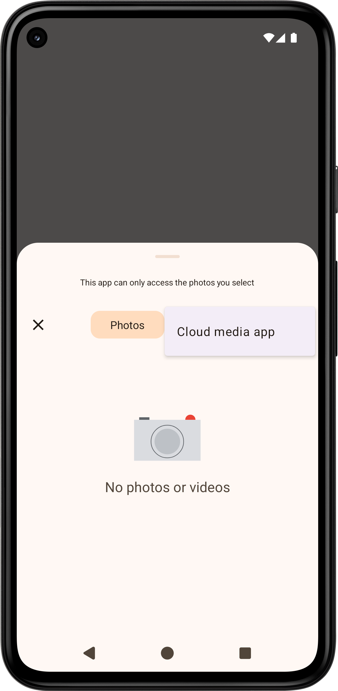
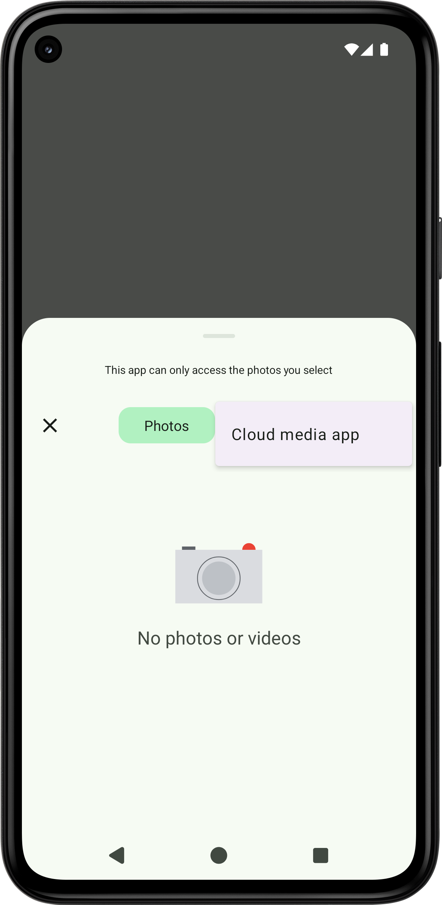

[写真選択ツール](https://developer.android.com/training/data-storage/shared/photopicker?hl=ja)は画像（動画）専用の選択ツールです．
しかし，メニューの背景色がおかしいです（[ダイナミックカラー](https://developer.android.com/develop/ui/views/theming/dynamic-colors?hl=ja)ではありません）．

[https://github.com/material-components/material-components-android/issues/3969](https://github.com/material-components/material-components-android/issues/3969)，[https://github.com/material-components/material-components-android/issues/4139](https://github.com/material-components/material-components-android/issues/4139)が思い出されます．

[https://issuetracker.google.com/issues/400894495](https://issuetracker.google.com/issues/400894495)