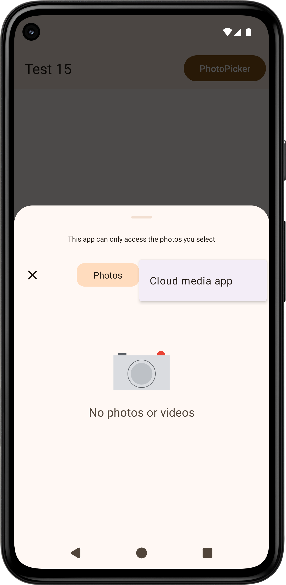
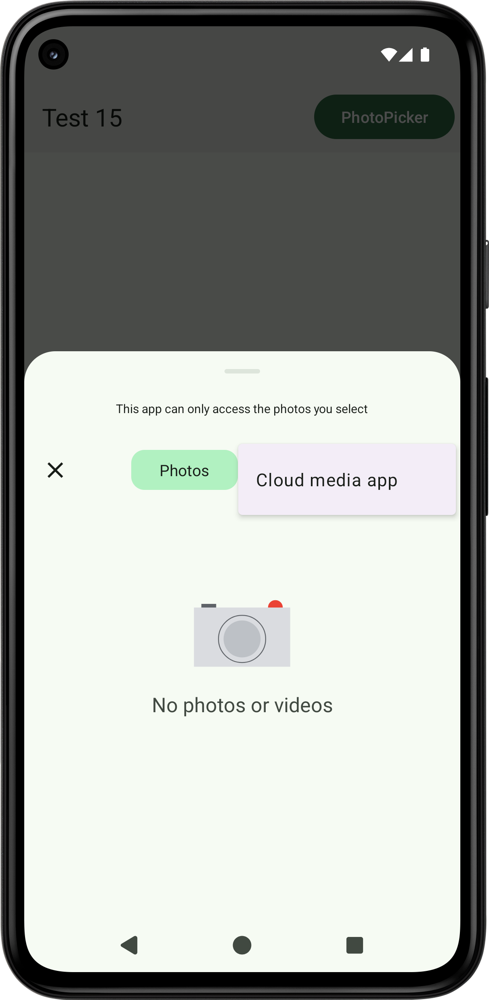
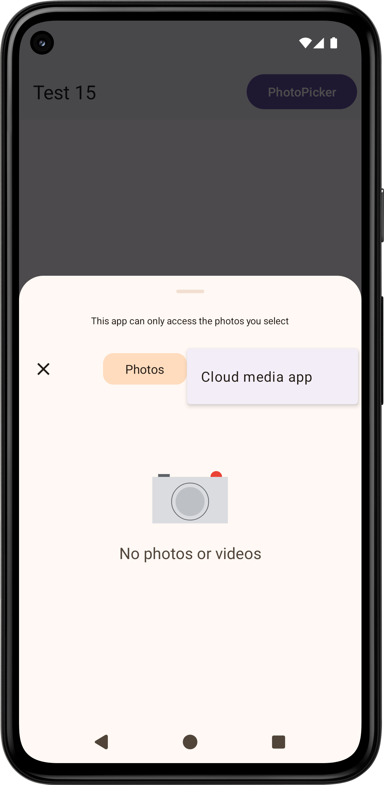

[写真選択ツール](https://developer.android.com/training/data-storage/shared/photopicker?hl=ja)は画像（動画）専用の選択ツールです．しかし，メニュー（Cloud media app）の背景色がおかしいです（アプリが[ダイナミックカラー](https://developer.android.com/develop/ui/views/theming/dynamic-colors?hl=ja)かどうかにかかわらず，メニューはダイナミックカラーではありません）：[https://issuetracker.google.com/issues/400894495](https://issuetracker.google.com/issues/400894495)．アプリがダイナミックカラーかどうかにかかわらず，ボタン（Photos）の背景色は常にダイナミックカラーです．写真選択ツールだけでなく，[ファイル選択ツール](https://developer.android.com/training/data-storage/shared/documents-files?hl=ja)，[Gboard](https://play.google.com/store/apps/details?id=com.google.android.inputmethod.latin)も．アプリがダイナミックカラーかどうかに追随する設定はありません（アプリのテーマにも追随しません．システム＝ライトテーマ，アプリ＝ダークテーマの時，写真選択ツール，ファイル選択ツール，Gboard＝ライトテーマ）．

\

[https://github.com/material-components/material-components-android/issues/3969](https://github.com/material-components/material-components-android/issues/3969)，[https://github.com/material-components/material-components-android/issues/4139](https://github.com/material-components/material-components-android/issues/4139)が思い出されます．

背景（スクリム）が濃すぎます：[https://issuetracker.google.com/issues/403485646](https://issuetracker.google.com/issues/403485646)，[https://github.com/material-components/material-components-android/issues/3635](https://github.com/material-components/material-components-android/issues/3635)．薄くする方法が分かりません．

Android 16でダイアログのスクリムが濃くなっています（汗）：[https://issuetracker.google.com/issues/414723477](https://issuetracker.google.com/issues/414723477)．