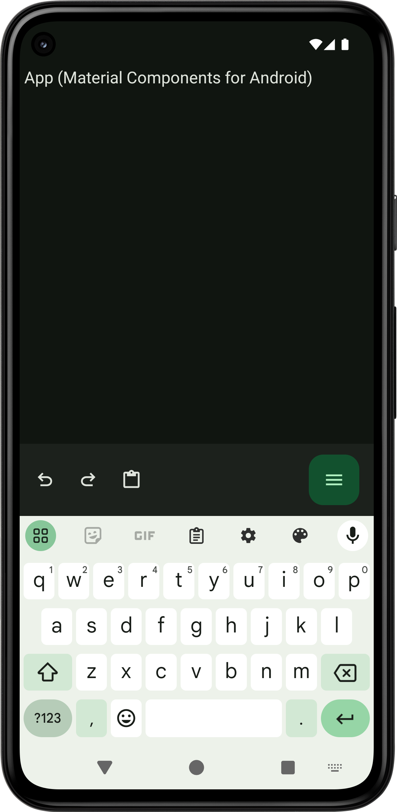

[ダイナミックカラー](https://developer.android.com/develop/ui/views/theming/dynamic-colors?hl=ja)のいいドキュメントが見当たりません．

アプリをダイナミックカラーにするためには，`Theme.Material3.DynamicColors.*`テーマ（またはそれを継承するテーマ）をセットするだけで十分です．

`app/src/main/res/values/themes.xml`:
```xml
<resources>
    <style name="Theme.App" parent="Theme.Material3.DynamicColors.DayNight.NoActionBar">
        ...
    </style>
</resources>
```
`app/src/main/AndroidManifest.xml`:
```
<manifest
    xmlns:android="http://schemas.android.com/apk/res/android">
    <application
        ...
        android:theme="@style/Theme.App">
        ...
    </application>
</manifest>
```
`Theme.Material3.DynamicColors.DayNight.NoActionBar`テーマは，アプリを[Material Design 3](https://m3.material.io/)，ダイナミックカラー，[ダークテーマ対応](https://developer.android.com/develop/ui/views/theming/darktheme?hl=ja)にし，[windowNoTitle](https://developer.android.com/reference/android/R.attr#windowNoTitle)をtrueにするテーマです．`Theme.Material3.DynamicColors.*`テーマ（またはそれを継承するテーマ）ではなく，`Theme.Material3.*`テーマ（またはそれを継承するテーマ）を使用することもできますが，アプリをダイナミックカラーにするためには，[`DynamicColors`](https://developer.android.com/reference/com/google/android/material/color/DynamicColors).[`applyToActivityIfAvailable`](https://developer.android.com/reference/com/google/android/material/color/DynamicColors#applyToActivityIfAvailable(android.app.Activity))()を呼び出す必要があります．

`app/src/main/java/com/github/manabu_nakamura/test/MainActivity.java`:
```java
public class MainActivity extends AppCompatActivity {
    @Override
    protected void onCreate(@Nullable Bundle savedInstanceState) {
        super.onCreate(savedInstanceState);
        DynamicColors.applyToActivityIfAvailable(this);
        ...
    }
}
```
ダイナミックカラーにより色の選択が楽になります．細かい設定も可能です．しかし，問題も残っています（[https://github.com/material-components/material-components-android/issues/3969](https://github.com/material-components/material-components-android/issues/3969)，[https://github.com/material-components/material-components-android/issues/4139](https://github.com/material-components/material-components-android/issues/4139)，[https://issuetracker.google.com/issues/400894495](https://issuetracker.google.com/issues/400894495)，[https://issuetracker.google.com/issues/369781732](https://issuetracker.google.com/issues/369781732)）．[Gboard](https://play.google.com/store/apps/details?id=com.google.android.inputmethod.latin)は．アプリがダイナミックカラーかどうかに追随する設定はありません（アプリのテーマにも追随しません．システム＝ライトテーマ，アプリ＝ダークテーマの時，Gboard＝ライトテーマ）．[写真選択ツール](https://developer.android.com/training/data-storage/shared/photopicker?hl=ja)，[ファイル選択ツール](https://developer.android.com/training/data-storage/shared/documents-files?hl=ja)も似たような感じです．非常に残念です．



ライブラリも公開されています（[https://github.com/material-foundation/material-color-utilities](https://github.com/material-foundation/material-color-utilities)）．余談ですが，新しい`Theme.Material3Expressive.*`テーマが開発されています．`Theme.MaterialComponents.*`テーマはMaterial Design 1，2用のテーマです．